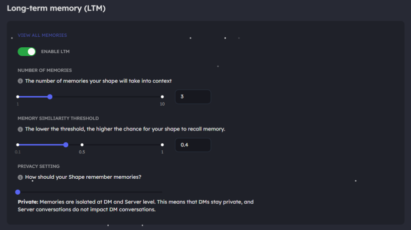

# Talk with your shape

Hi! Since you're here, it means that you've made your shape but are having a hard time understanding how to interact with it. Let's help you out! Follow these simple steps to interact with your shape:

1. **Go to the Shapes Platform**\
   Visit [https://shapes.inc/explore](https://shapes.inc/explore) and make sure you're logged in.
2. **Find Your Shape**\
   Scroll down to the **My Shapes** section and select the shape you want to interact with.\
   
3. **Access Your Shape's Dashboard**\
   Once you've clicked on your shape, you'll land on its dashboard.
   * **For smartphone users**: Open the selection menu.\
     .png>)
4. **Add Your Shape to a Server**\
   Click on the **Add to Server** tab.\
   .png>)
5. **Invite Your Shape to a Server**\
   [Learn more about adding bots to a server.](https://www.google.com/search?q=how+to+add+a+discord+bot+to+my+server)
6. **Return to the Server**\
   Go back to the server where you've added your shape and try pinging it.
7.  **Set Permissions**\
    Ensure that the shape has the following permissions in the channel where you want to interact with it:

    * View the channel
    * Read message history
    * Send messages

    You can also assign a dedicated channel where the shape will respond to every message. Use the shape's `/activate` command to configure this.

And just like that, you're ready to interact with your shape!

***

 **"Hi! I do want to interact with a shape, but I'm not its creator. How can I do so?"**

Simple! Follow the same steps outlined above or directly invite the shape:

* Use its `/link` command.
* Alternatively, click on the **Add App** button on its profile and proceed with the remaining steps.

Got more questions? Ping **@Shapes, Inc.** in our [Discord server](https://discord.gg/shapes).

***
